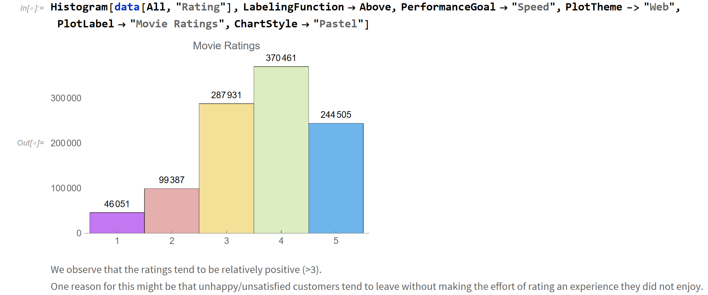
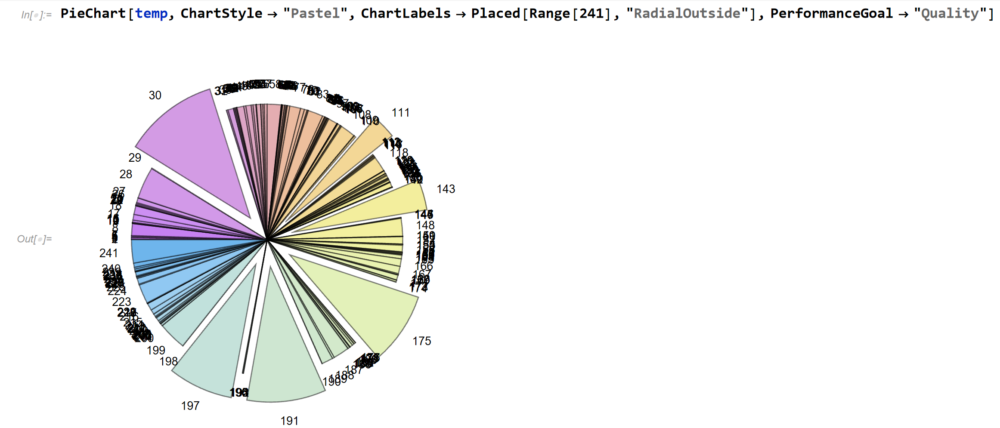
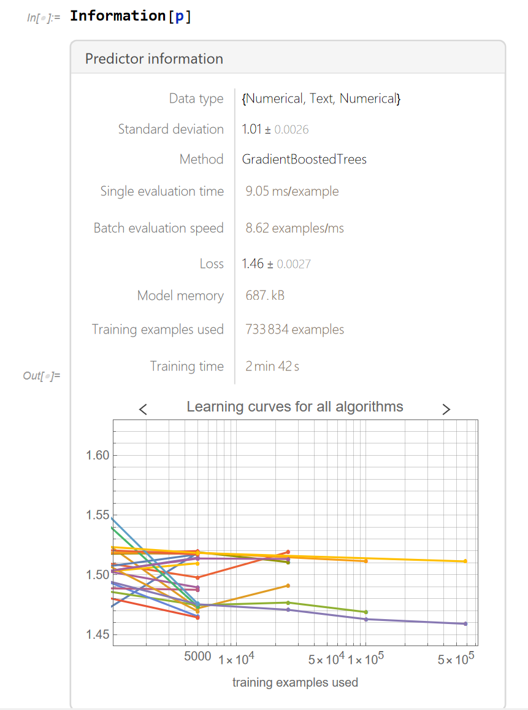

# Movie Recommendation

### Software 
Mathematica

[Dataset](https://www.kaggle.com/datasets/netflix-inc/netflix-prize-data) - Dataset provided by Netflix for the Netflix challenge 

#### Description:

Using the dataset provided by Netflix for the Netflix challenge, developed a recommendation system.
 
* Exploratory data analysis was performed and potential issues such as extremely sparse data availability, and the disproportional number of observations were identified.

* Naïve models, random assigning of rating along with Linear regression, Decision Trees, Random Forest, and Gradient Boosted Trees were employed to compare the performance of the final model.

* The final model was based on the correlation among the movies rated by the users.

* The model outputs movies that are closely correlated to the movies previously watched by a user.

#### Screenshots

  
&nbsp; &nbsp; &nbsp; &nbsp;
  

&nbsp; &nbsp; &nbsp; &nbsp;
  
 

